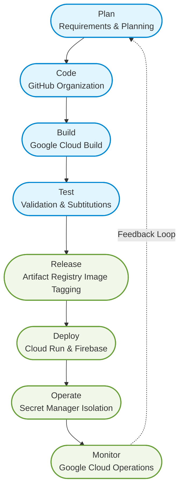

# DevOps 

```mermaid
flowchart TD
    %% Styling
    classDef devStage fill:#e1f5fe,stroke:#0288d1,stroke-width:2px;
    classDef opsStage fill:#f1f8e9,stroke:#689f38,stroke-width:2px;

    %% CI / Dev Nodes
    Plan([Plan<br/>Requirements & Planning]):::devStage
    Code([Code<br/>GitHub Organization]):::devStage
    Build([Build<br/>Google Cloud Build]):::devStage
    Test([Test<br/>Validation & Subtitutions]):::devStage

    %% CD / Ops Nodes
    Release([Release<br/>Artifact Registry Image Tagging]):::opsStage
    Deploy([Deploy<br/>Cloud Run & Firebase]):::opsStage
    Operate([Operate<br/>Secret Manager Isolation]):::opsStage
    Monitor([Monitor<br/>Google Cloud Operations]):::opsStage

    %% The Loop Flow
    Plan --> Code
    Code --> Build
    Build --> Test
    Test --> Release
    Release --> Deploy
    Deploy --> Operate
    Operate --> Monitor
    Monitor -.->|Feedback Loop| Plan
```