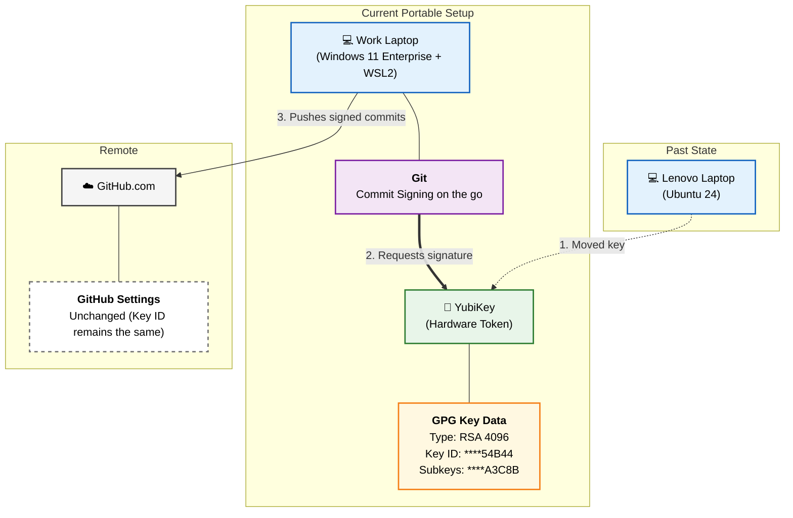

# GPG Key Migration & Portable Setup

Here is a visual representation of your GPG key migration and the current portable setup using a Mermaid flowchart. 

> [!TIP]
> **Using this in Draw.io**
> You can easily import this exact diagram into Draw.io by copying the Mermaid code block above and in Draw.io going to:
> **Arrange > Insert > Advanced > Mermaid...**
